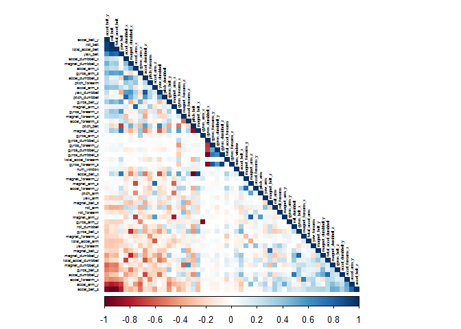
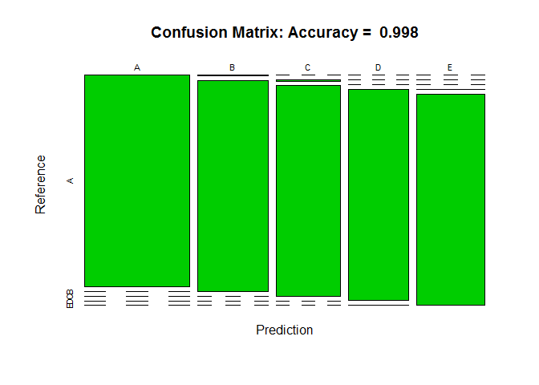

# Machine Learning Prediction of Weightlifting Exercise Effectiveness
Robert B. Herget  
February 18, 2017  


 
<br> 


The Human Activity Recognition (HAR) project collected exercise data, focusing on the quality of exercise related to specific motion types.  A more detailed explanation of the data collection process and project overview can be found at the [HAR website](http://groupware.les.inf.puc-rio.br/har). 
<br>

We are trying to predict the "classe" variable, which assigns one of five letter grades to the exercise -  "A" (the best), B, C, D and "E" (the worst). This report outlines the process in building the model we use to predict "classe". 

<br> 

####Establish a Project Folder 
We begin by establishing a project folder (if one hasn't been established already): 
<br>

```r
mainDir <- "C:\\Users\\Bob\\Documents\\R\\08 Practical Machine Learning"
subDir <- "Exercise Project"

if(file.exists(subDir)){
  setwd(file.path(mainDir, subDir))
} else {
  dir.create(file.path(mainDir, subDir), showWarnings = FALSE)
  setwd(file.path(mainDir, subDir))
}
```
 
<br> 

####Load Relevant Packages 
The following packages will be used: 
<br>

```r
library(caret)
library(corrplot)
```
<br> 

####Download and Read Data

The training and test datasets - each have 160 variables with 19,622 and 20 observations, respectively - are downloaded and read into R as follows: 
<br>


```r
#DOWNLOAD & READ TRAINING DATA:
download.file("https://d396qusza40orc.cloudfront.net/predmachlearn/pml-training.csv",
              destfile="trainData")
trainOrig <- read.csv("./trainData", header = TRUE, na.strings = c("NA", ""))

#DOWNLOAD & READ TEST DATA
download.file("https://d396qusza40orc.cloudfront.net/predmachlearn/pml-testing.csv",
              destfile="testData")
testOrig <- read.csv("./testData", header = TRUE, na.strings = c("NA", ""))
```
<br>
Note that in loading the object, blanks are converted to "NA". This needed to execute a subsequent step. 

<br>

####Cleaning Data

The following steps convert a raw dataset into a workable one.  
<br>
First, all "NA" values - whether native to the original dataset or coerced - are removed. The object cSum is a numeric object that summarizes the number of "NAs" in each column: 
<br>


```r
cSum <- colSums(is.na(trainOrig))
```
<br>
Next, original variables are subsetted to include variables containing non-NA data (via the argument cSum==0). This same command is applied to both the training and test sets, which have column consistency. This reduces the number of explanatory variables from 160 to 60. 
<br>

```r
trainClean <- trainOrig[, cSum == 0]
testClean <- testOrig[, cSum == 0]
```
<br>
Lastly, we further purify the dataset by removing columns that have little-to-no predictive relevance. The following commands reduce the size of the datasets from 60 to 54 variables:
<br>


```r
useless <- grepl("X|user_name|raw_timestamp_part_1|raw_timestamp_part_2|
                 |cvtd_timestamp|new_window",
                 colnames(trainClean))
trainClean <- trainClean[, !useless]
testClean <- testClean[, !useless]
```
<br> 

####Variable Correlation and Model Selection
Prior to model development, we take an exploratory look at variable correlation. As a general rule, we want to use as few variables with the most explanatory power as possible. The matrix below depicts the relationship between variables:
<br>

```r
corMat <- cor(trainClean[, -54])
corrplot(corMat, order = "FPC", 
         method = "color",
         type = "lower",
         tl.cex = 0.4,
         tl.col = rgb(0,0,0))
```


 
<br>
The correlation matrix shows that generally, multicollinearity is not a huge issue across the independent variable set. This, along with the categorical nature of the dependant (classe) variable, we'll approach this problem using a random forest (RF) model. RF models tend to be quite accurate; however, tend to be slower, and in the absence of cross-validation, are prone to overfitting.  
<br> 

####Create Validation Dataset

Now that we have a cleaned, workable dataset, we can split-off a validation set from the training set: 
<br>


```r
inTrain = createDataPartition(y = trainClean$classe,
                              p = 0.75,
                              list = FALSE)
trainSet = trainClean[inTrain, ]
validSet = trainClean[-inTrain, ]
```
<br> 

####Model Creation & Validation 
We next train the random forest model. In this model, 4-fold cross-validation is used. Due to the computational intensity of this type of model, this step may take a relatively long time to execute: 
<br>

```r
ctrlRf <- trainControl(method = "cv", 4)
modelRf <- train(classe ~ ., 
                 data = trainSet,
                 method = "rf",
                 trControl = ctrlRf,
                 ntree = 150)
```
<br>

Now that the model is trained, we test the model on the validation set. Model performance can be assessed by generating a confusion matrix: 
<br>


```r
predictRf <- predict(modelRf, validSet)
confMatrix <- confusionMatrix(validSet$classe, predictRf)
confMatrix
```

```
## Confusion Matrix and Statistics
## 
##           Reference
## Prediction    A    B    C    D    E
##          A 1395    0    0    0    0
##          B    2  947    0    0    0
##          C    0    5  850    0    0
##          D    0    0    0  803    1
##          E    0    0    0    2  899
## 
## Overall Statistics
##                                          
##                Accuracy : 0.998          
##                  95% CI : (0.9963, 0.999)
##     No Information Rate : 0.2849         
##     P-Value [Acc > NIR] : < 2.2e-16      
##                                          
##                   Kappa : 0.9974         
##  Mcnemar's Test P-Value : NA             
## 
## Statistics by Class:
## 
##                      Class: A Class: B Class: C Class: D Class: E
## Sensitivity            0.9986   0.9947   1.0000   0.9975   0.9989
## Specificity            1.0000   0.9995   0.9988   0.9998   0.9995
## Pos Pred Value         1.0000   0.9979   0.9942   0.9988   0.9978
## Neg Pred Value         0.9994   0.9987   1.0000   0.9995   0.9998
## Prevalence             0.2849   0.1941   0.1733   0.1642   0.1835
## Detection Rate         0.2845   0.1931   0.1733   0.1637   0.1833
## Detection Prevalence   0.2845   0.1935   0.1743   0.1639   0.1837
## Balanced Accuracy      0.9993   0.9971   0.9994   0.9986   0.9992
```
<br>
The confusion matrix above shows the actual values along the horizontal and the predicted values along the vertical. Only 6 false-negative and 2 false-positive errors were made. The accuracy and estimated out-of-sample error are 99.84% and 0.16%, respectively. 


<br>

```r
plot(confMatrix$table,
     col = 67,
     main = paste("Confusion Matrix: Accuracy = ",
                  round(confMatrix$overall["Accuracy"], 4)))
```

<!-- -->
<br> 

####Prediction on Test Set
To reiterate, the purpose of this project is to predict the **Classe** variable of the 20-observation test set using the validated model. The following commands achieve this objective. Note the "problem_id" column must first be removed: 
<br>

```r
result <- predict(modelRf, testClean[, -54])
result
```

```
##  [1] B A B A A E D B A A B C B A E E A B B B
## Levels: A B C D E
```
<br>
The model successfully predicts each of the 20 **Classe** values.
<br>
<br>
<br>
**Citation:** 
<br>
*Ugulino, W.; Cardador, D.; Vega, K.; Velloso, E.; Milidiu, R.; Fuks, H. Wearable Computing: Accelerometers' Data Classification of Body Postures and Movements. Proceedings of 21st Brazilian Symposium on Artificial Intelligence. Advances in Artificial Intelligence - SBIA 2012. In: Lecture Notes in Computer Science. , pp. 52-61. Curitiba, PR: Springer Berlin / Heidelberg, 2012. ISBN 978-3-642-34458-9. DOI: 10.1007/978-3-642-34459-6_6.*
